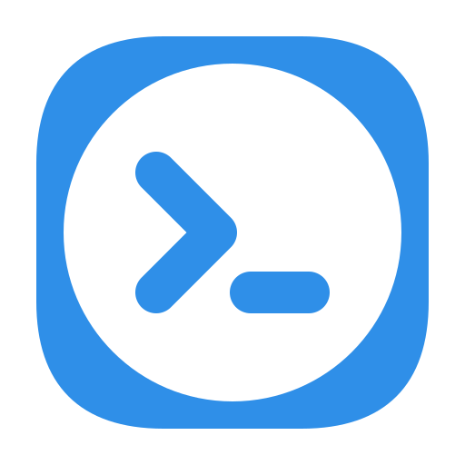

# Wristline

Wristline is a Wear OS app for Galaxy Watch that lets you follow and control AI coding-agent
sessions (Claude Code, OpenAI Codex CLI) running on your own computer. It talks only to Wristline
Bridge, an open-source server you run yourself, over HTTPS. There are no accounts, developer
servers, analytics or ads.

- [Privacy policy](privacy) · [개인정보처리방침](privacy#ko)
- Watch app source: <https://github.com/wristline/wristline>
- Bridge (companion server, npm package `wristline-bridge`): <https://github.com/wristline/wristline-bridge>
- Play Store: not yet published.
